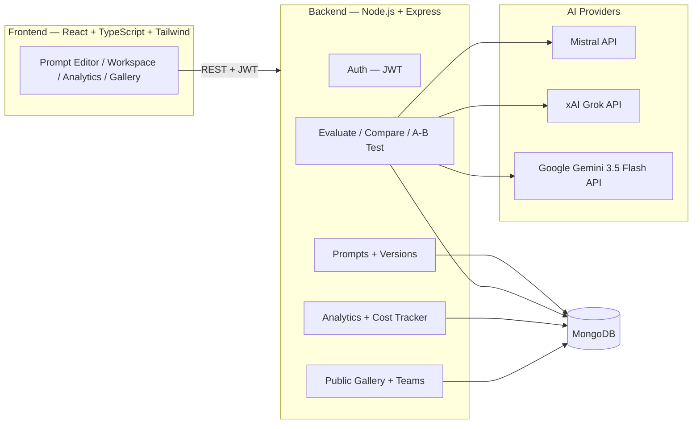
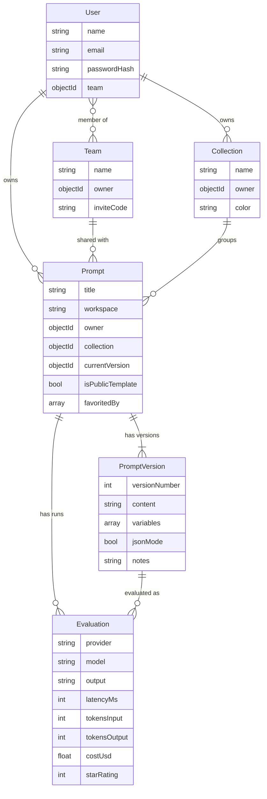

# PromptForge

A platform for designing, testing, versioning, and evaluating LLM prompts across multiple AI models — with analytics, cost tracking, and performance metrics.

---

## Why I built this

Teams that build with LLMs end up managing prompts the way developers managed code before version control existed: pasted into docs, overwritten in place, no history of what changed or why a change made outputs worse. There's no easy way to know which version of a prompt is live, whether Mistral, Grok, or Gemini 3.5 Flash handles it best, what it costs to run at scale, or whether an "improved" prompt is actually more consistent — or just felt better once.

PromptForge gives prompts the same tooling code already has: versioning with diffs and rollback, a place to test variables (`{{like_this}}`), side-by-side model comparison, A/B testing, and dashboards for cost, latency, and quality — plus a public gallery for reusable templates.

---

## Architecture



For a single evaluation: the editor renders `{{variables}}` into the saved prompt version → the backend calls the chosen provider's API → the response, token usage, latency, and cost get stored as an `Evaluation` document → the dashboard aggregates those into stats.

---

## Database Schema

MongoDB, via Mongoose. Six core collections:



---

## API

Base URL: `http://localhost:5000/api` (dev). All routes except `/auth/register`, `/auth/login`, `/auth/demo`, and `GET /gallery` require `Authorization: Bearer <token>`.

### Auth
| Method | Route | Description |
|---|---|---|
| POST | `/auth/register` | Create an account — `{ name, email, password }` |
| POST | `/auth/login` | Log in — `{ email, password }` → `{ token, user }` |
| POST | `/auth/demo` | Demo login — creates the demo account on first call if it doesn't exist yet, then logs in |
| GET | `/auth/me` | Current user |

### Prompts & Versions
| Method | Route | Description |
|---|---|---|
| GET | `/prompts?workspace=&collection=&q=&favorites=` | List/filter/search prompts |
| POST | `/prompts` | Create prompt — `{ title, description, workspace, collection, content }` |
| GET | `/prompts/:id` | Get one prompt (with current version) |
| PATCH | `/prompts/:id` | Update title/description/workspace/collection/publish flag |
| DELETE | `/prompts/:id` | Delete a prompt and its versions |
| POST | `/prompts/:id/favorite` | Toggle favorite |
| POST | `/prompts/:id/duplicate` | Duplicate a prompt with full version history |
| GET | `/prompts/:promptId/versions` | List versions (newest first) |
| POST | `/prompts/:promptId/versions` | Save a new version — `{ content, notes, jsonMode, functionCallingEnabled }` |
| POST | `/prompts/:promptId/versions/:versionNumber/rollback` | Roll back (creates a new version copying the old content) |
| GET | `/prompts/:promptId/versions/diff?from=&to=` | Line-level diff between two versions |

### Evaluate (run against models)
| Method | Route | Description |
|---|---|---|
| POST | `/evaluate` | Run one version against one provider — `{ promptId, versionId, provider, model?, variableValues }` |
| POST | `/evaluate/compare` | Run one version across multiple providers — `{ promptId, versionId, providers: [{provider, model?}], variableValues }` |
| POST | `/evaluate/ab-test` | Run two versions on the same input — `{ promptId, versionAId, versionBId, provider, variableValues }` |
| POST | `/evaluate/:id/rate` | Rate a run — `{ starRating }` or `{ criteria: { accuracy, creativity, relevance, jsonValidity } }` |
| GET | `/evaluate?promptId=` | Run history |

### Analytics
| Method | Route | Description |
|---|---|---|
| GET | `/analytics/dashboard` | Total prompts, success rate, avg latency, tokens used, cost, avg rating |
| GET | `/analytics/latency` | Time series of latency per run |
| GET | `/analytics/cost` | Cost today / this month |
| GET | `/analytics/history` | Runs bucketed into today / yesterday / last week |

### Collections, Teams, Gallery, Export
| Method | Route | Description |
|---|---|---|
| GET/POST/DELETE | `/collections` | Manage folders (Sales, Programming, Healthcare, Finance, ...) |
| GET | `/teams/me` | Current user's team |
| POST | `/teams` | Create a team (generates an invite code) |
| POST | `/teams/join` | Join with `{ inviteCode }` |
| POST | `/teams/leave` | Leave current team |
| GET | `/gallery` | Browse public templates (no auth required) |
| POST | `/gallery/:id/fork` | Fork a public template into your workspace |
| GET | `/export/:id/json` \| `/markdown` \| `/pdf` | Export a prompt + its version history |

---

## Folder Structure

```
promptforge/
├── backend/
│   ├── src/
│   │   ├── config/db.js               # Mongo connection
│   │   ├── models/                    # User, Team, Collection, Prompt, PromptVersion, Evaluation
│   │   ├── middleware/auth.js         # JWT guard
│   │   ├── services/aiProviders.js    # Mistral / Grok / Gemini 3.5 Flash adapter + cost calc + prompt scoring
│   │   ├── controllers/               # Business logic per resource
│   │   ├── routes/                    # Express routers, mounted in server.js
│   │   ├── utils/seed.js              # Demo user + sample prompt
│   │   └── server.js                  # App entry point
│   ├── .env.example
│   ├── Dockerfile
│   └── package.json
├── frontend/
│   ├── src/
│   │   ├── pages/                     # Login, Register, Workspace, PromptEditor, Analytics, Gallery, TeamWorkspace, Favorites, Search
│   │   ├── components/                # Sidebar, Layout, VariablesPanel, VersionControlPanel, ModelComparePanel, ABTestPanel, EvaluationCard, ExportMenu, PromptCard, Toast
│   │   ├── context/AuthContext.tsx
│   │   ├── lib/api.ts                 # Axios client + shared types
│   │   └── App.tsx / main.tsx
│   ├── .env.example
│   ├── vercel.json
│   └── package.json
├── docker-compose.yml                 # Local Mongo + backend
├── render.yaml                        # Render deploy blueprint (backend)
└── README.md
```

---

## Tech Stack

**Frontend:** React, TypeScript, Tailwind CSS, React Query, React Router, Recharts, lucide-react
**Backend:** Node.js, Express, MongoDB (Mongoose), JWT, express-rate-limit, PDFKit
**AI:** Mistral API, xAI Grok API, Google Gemini 3.5 Flash API — each provider is optional; if a key is missing, that provider runs in mock mode so the app is demoable without billing set up.

---

## Setup

### Prerequisites
- Node.js 18+
- A MongoDB instance — [MongoDB Atlas](https://www.mongodb.com/atlas) free tier, or local `mongod` / the included Docker Compose

### 1. Backend
```bash
cd backend
cp .env.example .env       # fill in MONGO_URI, JWT_SECRET, and any AI provider keys you have
npm install
npm run seed                # optional: adds a sample prompt to the demo account (the account itself is auto-created on first demo login)
npm run dev
```

### 2. Frontend
```bash
cd frontend
cp .env.example .env        # set VITE_API_URL if the backend isn't on localhost:5000
npm install
npm run dev
```

Visit `http://localhost:5173`.

### Adding real AI provider keys
Add any of these to `backend/.env` — only the ones you set are called live, the rest fall back to mock output:
```
MISTRAL_API_KEY=...
GROK_API_KEY=...
GEMINI_API_KEY=...
```

---

## Deployment

1. **Database — MongoDB Atlas**: create a free cluster, add a database user, whitelist your IP (or `0.0.0.0/0` for simplicity during setup), and copy the connection string into `MONGO_URI`.
2. **Backend — Render** (or Railway/Fly.io): new Web Service → root directory `backend` → build command `npm install`, start command `npm start` → add env vars `MONGO_URI`, `JWT_SECRET`, `CLIENT_URL`, and any AI keys. A `render.yaml` blueprint is included at the repo root.
3. **Frontend — Vercel**: new project → root directory `frontend` → framework preset Vite → env var `VITE_API_URL` = your Render backend URL + `/api`.
4. Update the backend's `CLIENT_URL` to the live Vercel URL (for CORS) and redeploy.

*Not deployed yet — link and screenshots go here once it's live.*

---

## Known limitations / what's next

- No Redis, so repeated evaluations and rate limiting aren't cached — fine at this scale, would matter for real traffic.
- Function calling is a toggle, not a schema builder — you can't define tool signatures visually yet.
- Team roles are flat membership only, no owner/editor/viewer distinction.
- Evaluation runs wait for full completions rather than streaming.
- Prompt Score is heuristic-based, not an LLM-as-judge.

---

## License

MIT
